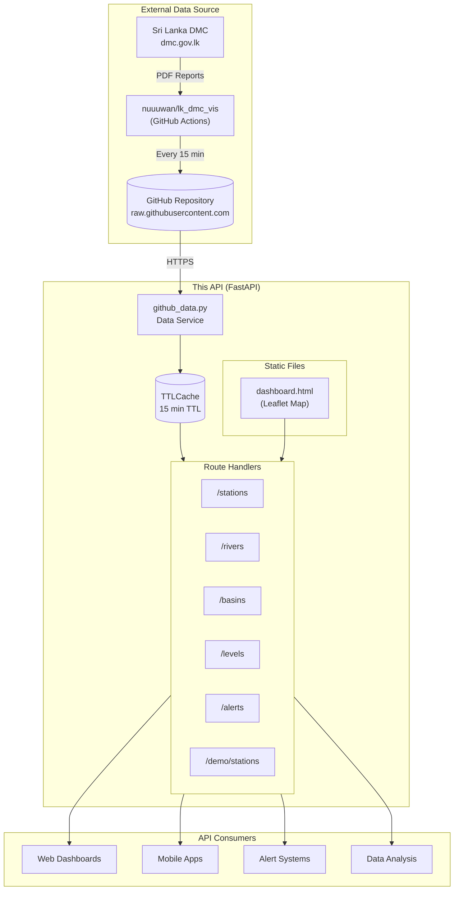
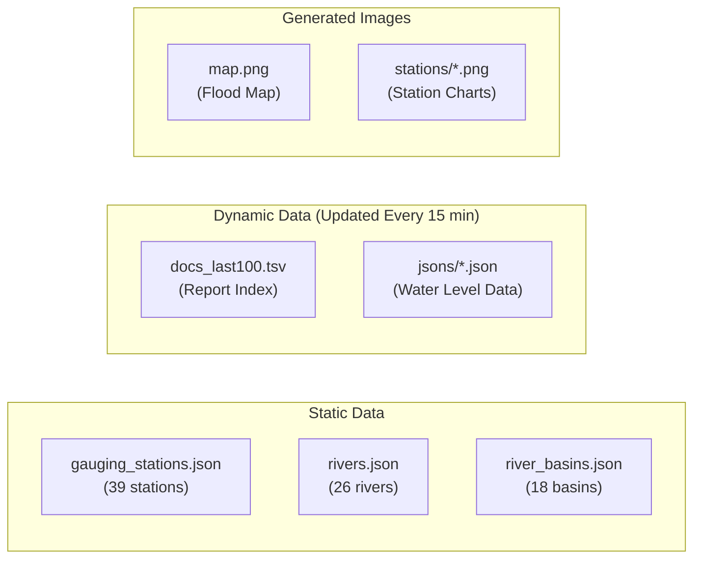
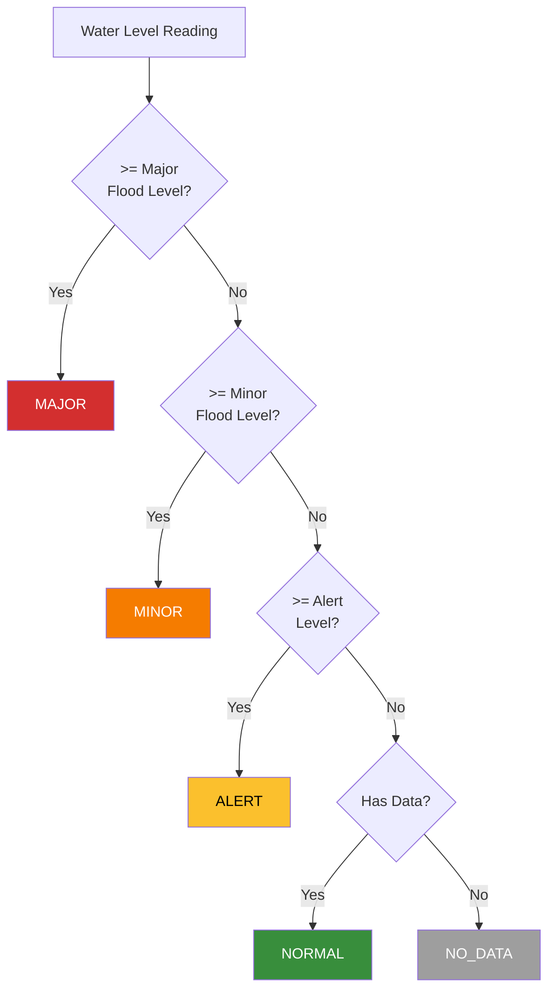
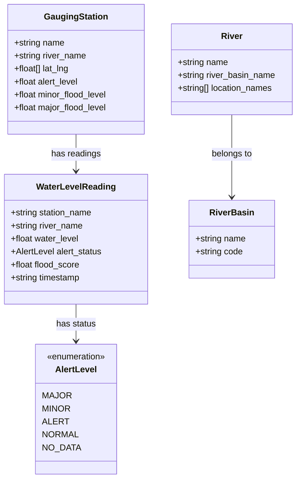
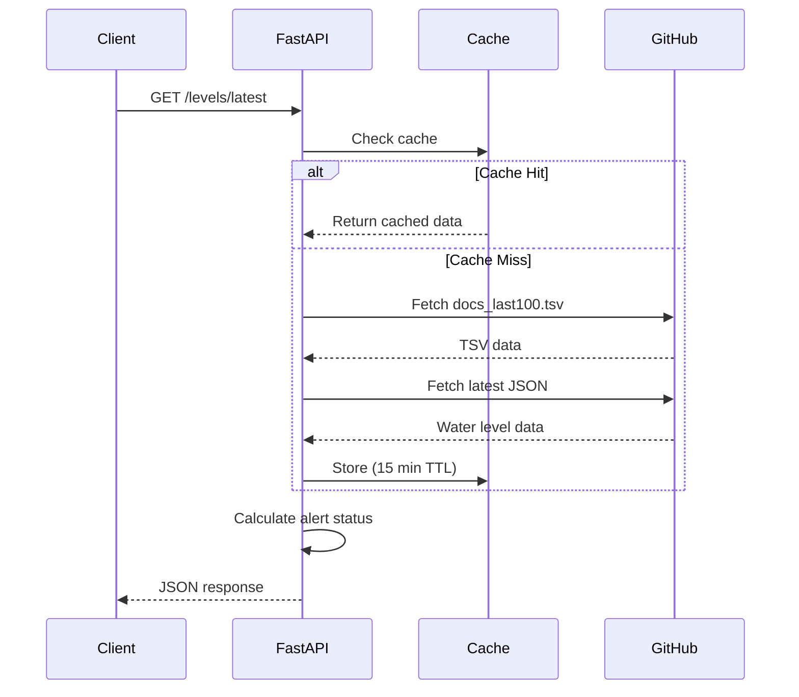
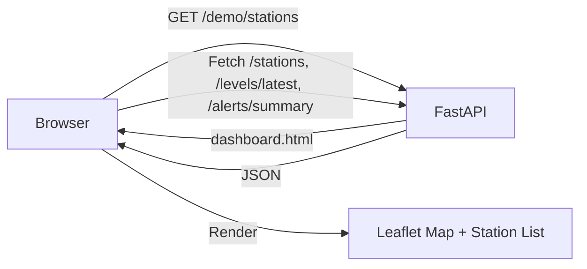

# Architecture

## Overview

This is a stateless FastAPI REST API that wraps flood monitoring data from Sri Lanka's Disaster Management Center (DMC). It fetches and caches data from the [nuuuwan/lk_dmc_vis](https://github.com/nuuuwan/lk_dmc_vis) GitHub repository.

## System Architecture



## Data Files Structure

The upstream [nuuuwan/lk_dmc_vis](https://github.com/nuuuwan/lk_dmc_vis) repository provides:



## Project Structure

```
lk_flood_api/
├── app/
│   ├── main.py              # FastAPI app, CORS, router registration
│   ├── models/
│   │   └── schemas.py       # Pydantic models
│   ├── routes/
│   │   ├── stations.py      # GET /stations, /stations/{name}
│   │   ├── rivers.py        # GET /rivers, /rivers/{name}, /rivers/{name}/stations
│   │   ├── basins.py        # GET /basins, /basins/{name}, /basins/{name}/rivers
│   │   ├── levels.py        # GET /levels/latest, /levels/history, /levels/map, /levels/chart
│   │   └── alerts.py        # GET /alerts, /alerts/summary
│   ├── services/
│   │   └── github_data.py   # Data fetching, caching, calculations
│   └── static/
│       └── dashboard.html   # Interactive map dashboard (Leaflet.js)
├── requirements.txt
├── vercel.json
└── README.md
```

## Alert Level Calculation



## Flood Score Calculation

The `flood_score` is a normalized value indicating flood severity:

```
flood_score = (water_level - alert_level) / (major_flood_level - alert_level)
```

| Score | Meaning |
|-------|---------|
| < 0 | Below alert level |
| 0 | At alert level |
| 0.5 | Halfway between alert and major |
| 1.0 | At major flood level |
| > 1 | Above major flood level |

## Data Models



## Request Flow



## Dependencies

| Package | Purpose |
|---------|---------|
| [FastAPI](https://fastapi.tiangolo.com/) | Web framework |
| [Uvicorn](https://www.uvicorn.org/) | ASGI server |
| [httpx](https://www.python-httpx.org/) | Async HTTP client |
| [Pydantic](https://docs.pydantic.dev/) | Data validation |
| [cachetools](https://cachetools.readthedocs.io/) | TTL-based caching |
| [Leaflet.js](https://leafletjs.com/) | Interactive map (dashboard) |

## Demo Dashboard

The `/demo/stations` endpoint serves a single-page application that visualizes station data:



**Features:**
- Interactive map with color-coded station markers
- Sidebar with filterable station list (MAJOR first)
- Filter buttons by alert level
- Auto-refresh every 5 minutes
- Mobile responsive design
- Dark theme using CartoDB tiles

## Design Decisions

1. **Stateless Architecture**: No database. Data fetched on-demand from GitHub keeps the API always in sync with the source.

2. **15-minute Cache**: Matches the upstream update frequency. Reduces GitHub API load while keeping data fresh.

3. **Async Throughout**: Uses `httpx` and async functions for non-blocking I/O, enabling high concurrency.

4. **API-level Alert Calculations**: Computed on each request rather than relying on pre-computed values, ensuring consistency.

5. **Image Proxying**: Serves map and chart images through the API with cache headers, enabling CORS access from web apps.

## Data Source Acknowledgment

This API relies entirely on data from:

- **[nuuuwan/lk_dmc_vis](https://github.com/nuuuwan/lk_dmc_vis)** - Open-source data pipeline by [@nuuuwan](https://github.com/nuuuwan)
- **[Sri Lanka Disaster Management Center](https://www.dmc.gov.lk)** - Original source of flood monitoring data
