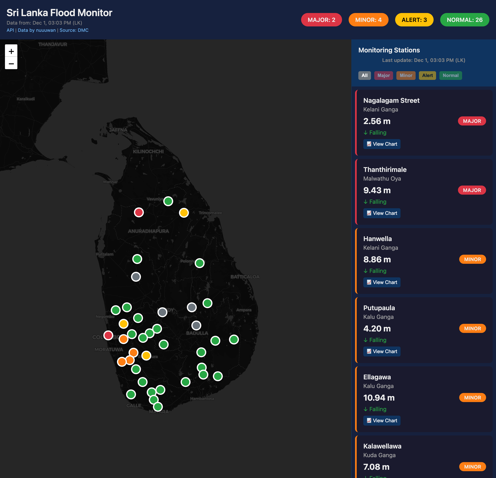
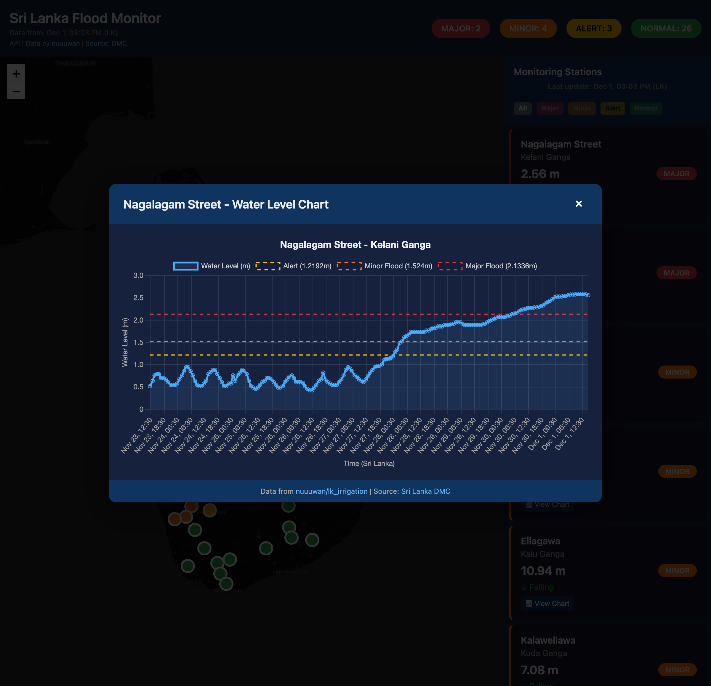
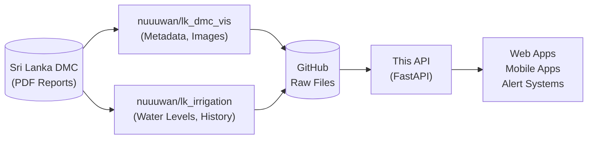

# Sri Lanka Flood Data API

REST API for Sri Lanka river water level and flood monitoring data.

**Live API:** https://lk-flood-api.vercel.app

| Documentation | URL |
|--------------|-----|
| Swagger UI | https://lk-flood-api.vercel.app/docs |
| ReDoc | https://lk-flood-api.vercel.app/redoc |
| OpenAPI Spec | https://lk-flood-api.vercel.app/openapi.json |

## Features

- Real-time water level data for 39 gauging stations
- Alert status classification (MAJOR, MINOR, ALERT, NORMAL)
- Historical water level readings (~8 days)
- River and basin information
- Flood map and station chart images
- Interactive dashboard with water level trend charts

## Live Demo

**Dashboard:** https://lk-flood-api.vercel.app/demo/stations

Interactive map with color-coded markers showing real-time flood status across Sri Lanka.



Click "View Chart" on any station to see historical water level trends with threshold lines:



## API Documentation

### Swagger UI


### ReDoc


## Data Flow



The API merges data from two upstream sources:
- **lk_irrigation**: Fresh water levels (updates every ~10 min) + 8 days of historical data
- **lk_dmc_vis**: Metadata (remarks, rising/falling, rainfall) + pre-rendered images

## API Endpoints

### Health
| Method | Endpoint | Description |
|--------|----------|-------------|
| GET | `/health` | API health check |

### Stations
| Method | Endpoint | Description |
|--------|----------|-------------|
| GET | `/stations` | List all gauging stations |
| GET | `/stations/{name}` | Get station with latest reading |

### Rivers
| Method | Endpoint | Description |
|--------|----------|-------------|
| GET | `/rivers` | List all rivers |
| GET | `/rivers/{name}` | Get river details |
| GET | `/rivers/{name}/stations` | Get stations on a river |

### Basins
| Method | Endpoint | Description |
|--------|----------|-------------|
| GET | `/basins` | List all river basins |
| GET | `/basins/{name}` | Get basin details |
| GET | `/basins/{name}/rivers` | Get rivers in a basin |

### Water Levels
| Method | Endpoint | Description |
|--------|----------|-------------|
| GET | `/levels/latest` | Latest readings for all stations |
| GET | `/levels/history/{station}?limit=200` | Historical readings (~8 days) |
| GET | `/levels/chart-data/{station}` | Chart data with thresholds (for Chart.js) |
| GET | `/levels/map` | Current flood map (PNG) |
| GET | `/levels/chart/{station}` | Pre-rendered station chart (PNG) |

### Alerts
| Method | Endpoint | Description |
|--------|----------|-------------|
| GET | `/alerts` | Stations in ALERT/MINOR/MAJOR status |
| GET | `/alerts/summary` | Count of stations by alert level |

### Dashboard
| Method | Endpoint | Description |
|--------|----------|-------------|
| GET | `/demo/stations` | Interactive map with station locations, alert status, and Chart.js water level charts |

## Local Development

```bash
# Create virtual environment
python -m venv .venv
source .venv/bin/activate  # On Windows: .venv\Scripts\activate

# Install dependencies
pip install -r requirements.txt

# Run the server
uvicorn app.main:app --reload
```

Visit http://localhost:8000/docs for interactive API documentation (Swagger UI).

## Data Source & Acknowledgments

This API consumes data from two open-source data pipelines by [@nuuuwan](https://github.com/nuuuwan):

| Repository | Data Provided | Update Frequency |
|------------|--------------|------------------|
| [nuuuwan/lk_irrigation](https://github.com/nuuuwan/lk_irrigation) | Water levels, historical data | ~10 minutes |
| [nuuuwan/lk_dmc_vis](https://github.com/nuuuwan/lk_dmc_vis) | Metadata (remarks, trend), images | ~3 hours |

Both pipelines:
1. Fetch data from the [Sri Lanka Disaster Management Center (DMC)](https://www.dmc.gov.lk)
2. Parse and extract water level data
3. Publish structured JSON data to GitHub

### Original Data Source

**Sri Lanka Disaster Management Center (DMC)**
- Website: [https://www.dmc.gov.lk](https://www.dmc.gov.lk)
- Reports: [River Water Level & Flood Warnings](https://www.dmc.gov.lk/index.php?option=com_dmcreports&view=reports&Itemid=277&report_type_id=6&lang=en)

The DMC is the official government agency responsible for disaster management in Sri Lanka, operating under the Ministry of Defence.

## License

MIT
